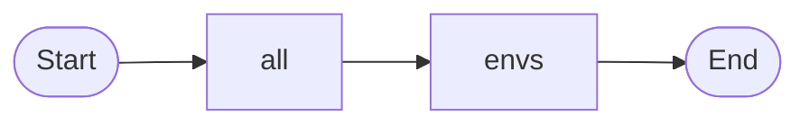
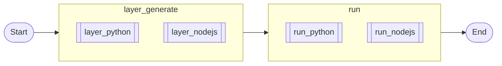
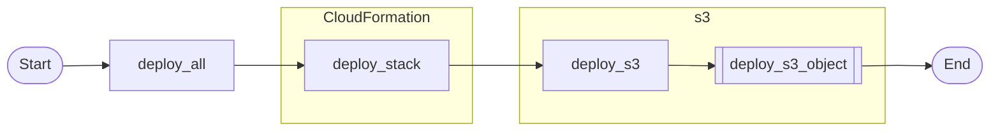
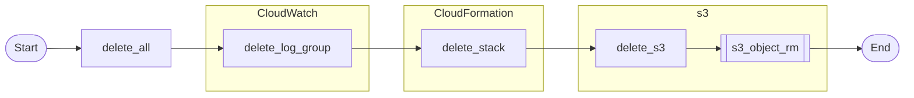

# 1. Overview
You won't be taught any programming language here. 

It will only tell you how to publish the program to Lambda, invoke your application on Lambda or run on local.

You need an aws account at first !

# 2. Depend on

- [AWS CLI](https://aws.amazon.com/tw/cli/)

- [Amazon S3](https://aws.amazon.com/tw/s3)

- [AWS Lambda](https://aws.amazon.com/tw/lambda/)

- [Amazon CloudWatch](https://aws.amazon.com/tw/cloudwatch/)

- [AWS CloudFormation](https://aws.amazon.com/tw/cloudformation/)

- [pythonX9](https://github.com/lankahsu520/pythonX9)

- [awsP9](https://github.com/lankahsu520/awsP9)


# 3. Current Status


# 4. Build

## 4.1. Hello, Lambda! (write functions in Pyton)

> The 1st python, you can edit it.

- [lambda_function.py](https://github.com/lankahsu520/LambdaHello/blob/main/01_HelloLambda/function/lambda_function.py)

## 4.2. To create a new bucket



```bash
$ make
----->> envs
PROJECT_JSON: project.json
RUNTIME: python3.8
RUNTIME_SHORT: python
STACK_NAME: LambdaHello
S3_BUCKET_NAME: lambda-artifacts520
LAMBDA_FUNCTION_DIR: function
EVENT_JSON_FILE: event.json
RESULT_JSON_FILE: result.json
CONTENT_URI: package
TEMPLATE_FILE: template.yml
OUTPUT_TEMPLATE_FILE: out.yml

----->> .s3_bucket_chk - lambda-artifacts520
Found lambda-artifacts520 !!!

```

## 4.3. Run on local

> I put aws-xray-sdk and launchpadlib in requirements.txt.



```bash
$ make run
Collecting aws-xray-sdk==2.4.3
  Using cached aws_xray_sdk-2.4.3-py2.py3-none-any.whl (87 kB)
Processing /home/lanka/.cache/pip/wheels/84/54/8d/11bb540d29f8bdf4e00b6c76ef332b794cf9e4e73552306749/launchpadlib-1.10.13-py3-none-any.whl
Collecting jsonpickle
  Using cached jsonpickle-3.0.1-py2.py3-none-any.whl (40 kB)
Processing /home/lanka/.cache/pip/wheels/a0/0b/ee/e6994fadb42c1354dcccb139b0bf2795271bddfe6253ccdf11/future-0.18.3-py3-none-any.whl
Collecting botocore>=1.11.3
  Downloading botocore-1.29.109-py3-none-any.whl (10.6 MB)
     |████████████████████████████████| 10.6 MB 840 kB/s
Collecting wrapt
  Using cached wrapt-1.15.0-cp38-cp38-manylinux_2_5_x86_64.manylinux1_x86_64.manylinux_2_17_x86_64.manylinux2014_x86_64.whl (81 kB)
Collecting setuptools
  Using cached setuptools-67.6.1-py3-none-any.whl (1.1 MB)
Collecting six
  Using cached six-1.16.0-py2.py3-none-any.whl (11 kB)
Collecting keyring
  Using cached keyring-23.13.1-py3-none-any.whl (37 kB)
Collecting httplib2
  Using cached httplib2-0.22.0-py3-none-any.whl (96 kB)
Processing /home/lanka/.cache/pip/wheels/c4/48/90/eb8111e2bd12cea5be917af6f45805d79e587c924fe6aa0d06/lazr.uri-1.0.6-py3-none-any.whl
Collecting lazr.restfulclient>=0.9.19
  Using cached lazr.restfulclient-0.14.5-py2.py3-none-any.whl (67 kB)
Collecting testresources
  Using cached testresources-2.0.1-py2.py3-none-any.whl (36 kB)
Processing /home/lanka/.cache/pip/wheels/4f/5a/5f/bf1e912567e49022b2fa0ecbbdb5ef4b7a8af072a2ddd2f502/wadllib-1.3.6-py3-none-any.whl
Collecting python-dateutil<3.0.0,>=2.1
  Using cached python_dateutil-2.8.2-py2.py3-none-any.whl (247 kB)
Collecting jmespath<2.0.0,>=0.7.1
  Using cached jmespath-1.0.1-py3-none-any.whl (20 kB)
Collecting urllib3<1.27,>=1.25.4
  Using cached urllib3-1.26.15-py2.py3-none-any.whl (140 kB)
Collecting jeepney>=0.4.2; sys_platform == "linux"
  Using cached jeepney-0.8.0-py3-none-any.whl (48 kB)
Collecting SecretStorage>=3.2; sys_platform == "linux"
  Using cached SecretStorage-3.3.3-py3-none-any.whl (15 kB)
Collecting importlib-metadata>=4.11.4; python_version < "3.12"
  Downloading importlib_metadata-6.2.0-py3-none-any.whl (21 kB)
Collecting importlib-resources; python_version < "3.9"
  Using cached importlib_resources-5.12.0-py3-none-any.whl (36 kB)
Collecting jaraco.classes
  Using cached jaraco.classes-3.2.3-py3-none-any.whl (6.0 kB)
Collecting pyparsing!=3.0.0,!=3.0.1,!=3.0.2,!=3.0.3,<4,>=2.4.2; python_version > "3.0"
  Using cached pyparsing-3.0.9-py3-none-any.whl (98 kB)
Collecting distro
  Using cached distro-1.8.0-py3-none-any.whl (20 kB)
Collecting oauthlib
  Using cached oauthlib-3.2.2-py3-none-any.whl (151 kB)
Collecting pbr>=1.8
  Using cached pbr-5.11.1-py2.py3-none-any.whl (112 kB)
Collecting cryptography>=2.0
  Using cached cryptography-40.0.1-cp36-abi3-manylinux_2_17_x86_64.manylinux2014_x86_64.whl (3.7 MB)
Collecting zipp>=0.5
  Using cached zipp-3.15.0-py3-none-any.whl (6.8 kB)
Collecting more-itertools
  Using cached more_itertools-9.1.0-py3-none-any.whl (54 kB)
Collecting cffi>=1.12
  Using cached cffi-1.15.1-cp38-cp38-manylinux_2_17_x86_64.manylinux2014_x86_64.whl (442 kB)
Collecting pycparser
  Using cached pycparser-2.21-py2.py3-none-any.whl (118 kB)
Installing collected packages: jsonpickle, future, six, python-dateutil, jmespath, urllib3, botocore, wrapt, aws-xray-sdk, setuptools, jeepney, pycparser, cffi, cryptography, SecretStorage, zipp, importlib-metadata, importlib-resources, more-itertools, jaraco.classes, keyring, pyparsing, httplib2, lazr.uri, distro, wadllib, oauthlib, lazr.restfulclient, pbr, testresources, launchpadlib
Successfully installed SecretStorage-3.3.3 aws-xray-sdk-2.4.3 botocore-1.29.109 cffi-1.15.1 cryptography-40.0.1 distro-1.8.0 future-0.18.3 httplib2-0.22.0 importlib-metadata-6.2.0 importlib-resources-5.12.0 jaraco.classes-3.2.3 jeepney-0.8.0 jmespath-1.0.1 jsonpickle-3.0.1 keyring-23.13.1 launchpadlib-1.10.13 lazr.restfulclient-0.14.5 lazr.uri-1.0.6 more-itertools-9.1.0 oauthlib-3.2.2 pbr-5.11.1 pycparser-2.21 pyparsing-3.0.9 python-dateutil-2.8.2 setuptools-67.6.1 six-1.16.0 testresources-2.0.1 urllib3-1.26.15 wadllib-1.3.6 wrapt-1.15.0 zipp-3.15.0

----->> run_python
Hello, Lambda!
{'statusCode': 200, 'body': 'Hello from Lambda!'}


```

## 4.4. Deploy with AWS CloudFormation



```bash
$ make deploy_all
----->> layer_python - /work/codebase/lankahsu520/LambdaHello/package/


----->> deploy_s3_object - ./package
Uploading to LambdaHello//c1a0b6f82de64982d5b4c9c87e63b622  21999742 / 21999742.0  (100.00%)
Successfully packaged artifacts and wrote output template to file out.yml.
Execute the following command to deploy the packaged template
aws cloudformation deploy --template-file /work/codebase/lankahsu520/LambdaHello/out.yml --stack-name <YOUR STACK NAME>
----->> deploy_stack - LambdaHello

Waiting for changeset to be created..
Waiting for stack create/update to complete
Successfully created/updated stack - LambdaHello
----->> deploy_all - LambdaHello-function-dr5LawT0Vdnz

```

## 4.5.  To invoke the function

```bash
$ make invoke
----->> invoke - LambdaHello & LambdaHello-function-dr5LawT0Vdnz
{
    "StatusCode": 200,
    "ExecutedVersion": "$LATEST"
}
{"statusCode": 200, "body": "Hello from Lambda!"}

```

## 4.6. Delete with AWS CloudFormation



```bash
$ make delete_all
----->> envs
PROJECT_JSON: project.json
RUNTIME: python3.8
RUNTIME_SHORT: python
STACK_NAME: LambdaHello
S3_BUCKET_NAME: lambda-artifacts520
LAMBDA_FUNCTION_DIR: function
EVENT_JSON_FILE: event.json
RESULT_JSON_FILE: result.json
CONTENT_URI: package
TEMPLATE_FILE: template.yml
OUTPUT_TEMPLATE_FILE: out.yml

----->> s3_object_rm - s3://lambda-artifacts520/LambdaHello
delete: s3://lambda-artifacts520/LambdaHello//a5b801b76878e138a815ad7a895378a3
delete: s3://lambda-artifacts520/LambdaHello//c1a0b6f82de64982d5b4c9c87e63b622
delete: s3://lambda-artifacts520/LambdaHello//2effb6540ad6691ea719ced727041602
delete: s3://lambda-artifacts520/LambdaHello//bac8ad3a2048d88e3e56a1f01ea54d8b
----->> delete_stack - LambdaHello
----->> delete_log_group - LambdaHello & /aws/lambda/LambdaHello-function-dr5LawT0Vdnz

```

# 5. Example or Usage

#### -  [01_HelloLambda](https://github.com/lankahsu520/LambdaHello/tree/main/01_HelloLambda)
#### -  [02_HelloLambda_with_payload](https://github.com/lankahsu520/LambdaHello/tree/main/02_HelloLambda_with_payload)
#### -  [03_HelloLambda_rw_s3](https://github.com/lankahsu520/LambdaHello/tree/main/03_HelloLambda_rw_s3)
#### -  [04_HelloLambda_deployS3trigger](https://github.com/lankahsu520/LambdaHello/tree/main/04_HelloLambda_deployS3trigger)

# 6. License
LambdaHello is under the New BSD License (BSD-3-Clause).


# 7. Documentation
- [helper_AWS-Lambda.md](https://github.com/lankahsu520/HelperX/blob/master/helper_AWS-Lambda.md) - AWS-Lambda helper.

